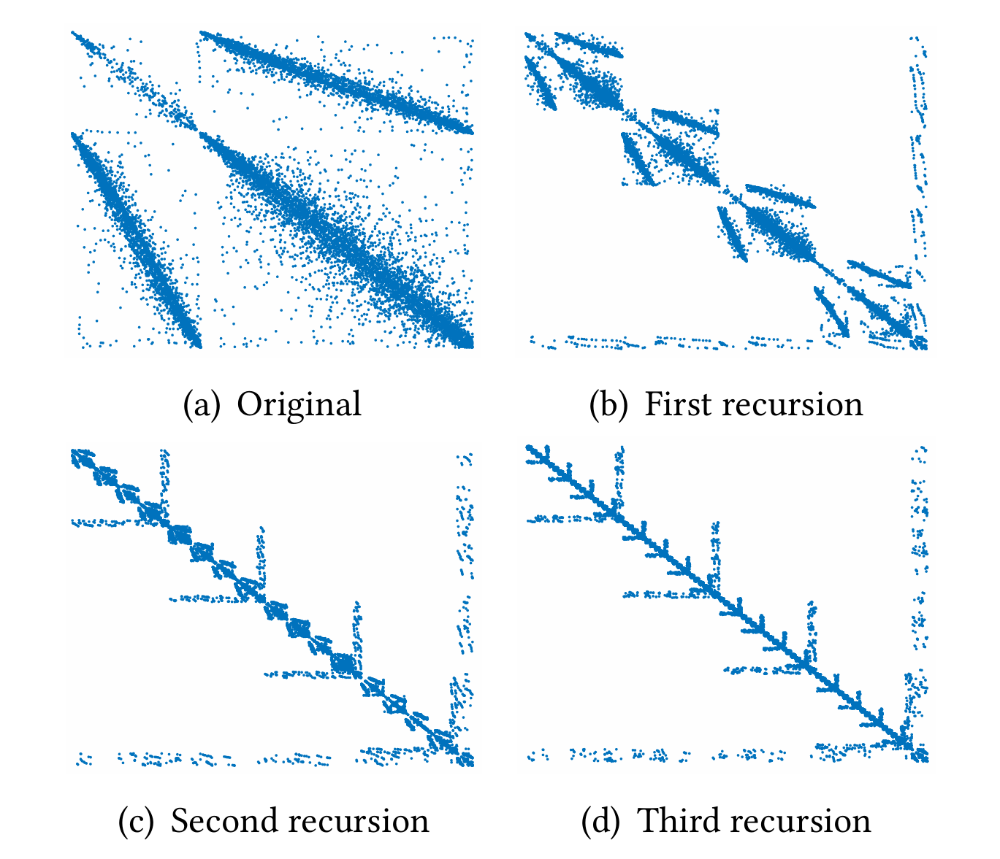

# MiniFS
Implemented Task Dependency Tree（TDTree）

.")
Figure 4: Cell numbering after 3 recursions of Algorithm 1 for a 2D triangular mesh with the flat strategy (𝑛𝑢𝑚𝑃𝑎𝑟𝑡=4).

Figure 5: The corresponding adjacency matrix of Figure 4.